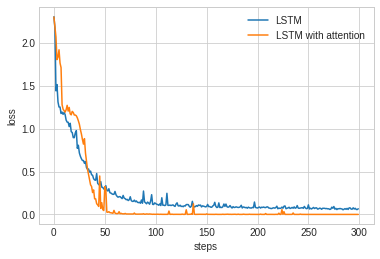
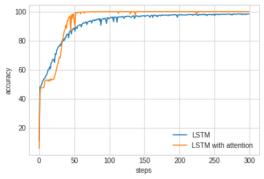

# lstm_attention

Reversing sequences with LSTM with attention mechanism

lstm_with_attention.py is an implementation of encoder decoder LSTM with attention mechanism

lstm.py is the exact copy without attention mechanism

The data is 20 000 artificially generated sentences of maximum length of 20 with dictonary of 10 words.

Transformed into integer sequences padded with 0

example:

input [0, 0, 0, 0, 0, 0, 0, 0, 0, 0, 0, 0, 0, 0, 4, 1, 9, 2, 8, 9]

output [9, 8, 2, 9, 1, 4, 0, 0, 0, 0, 0, 0, 0, 0, 0, 0, 0, 0, 0, 0]

the output is then one-hot encoded

MODEL

INPUT

EMBEDDING

ENCODER_LSTM

DECODER_LSTM_WITH_ATTENTION

DENSE

The results show that lstm with attention mechanism performs better than normal LSTM in this toy example

LSTM with attention

accuracy    99.988754

loss         0.000616

LSTM 

accuracy    95.722504

loss         0.157651
